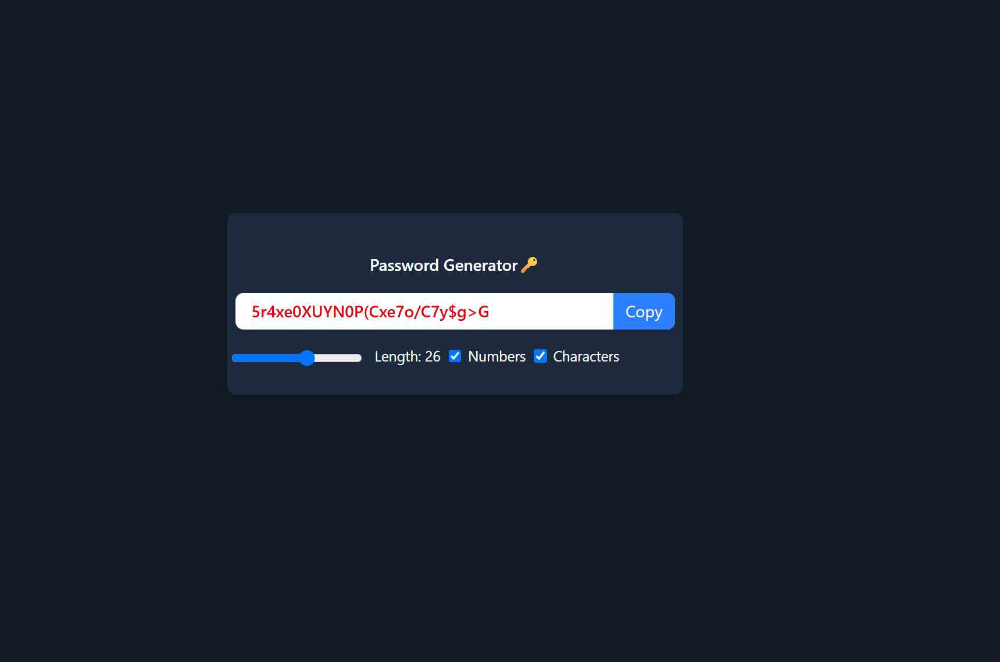

# 🔐 Password Generator App

A simple React-based password generator app that lets users create secure passwords with customizable options like length, numbers, and special characters. Built using React and Tailwind CSS.

## ✨ Features

- Generate random passwords instantly
- Set password **length** (6 to 40 characters)
- Toggle **numbers** and **special characters**
- Copy generated password to clipboard
- Fully responsive UI with Tailwind CSS

## 🛠️ Tech Stack

- **React**
- **Tailwind CSS**
- **JavaScript (ES6+)**

## 📸 Screenshot

_(Optional: Add a screenshot of the app here)_  

